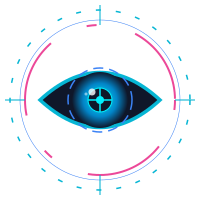
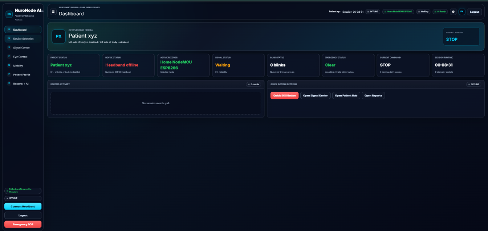
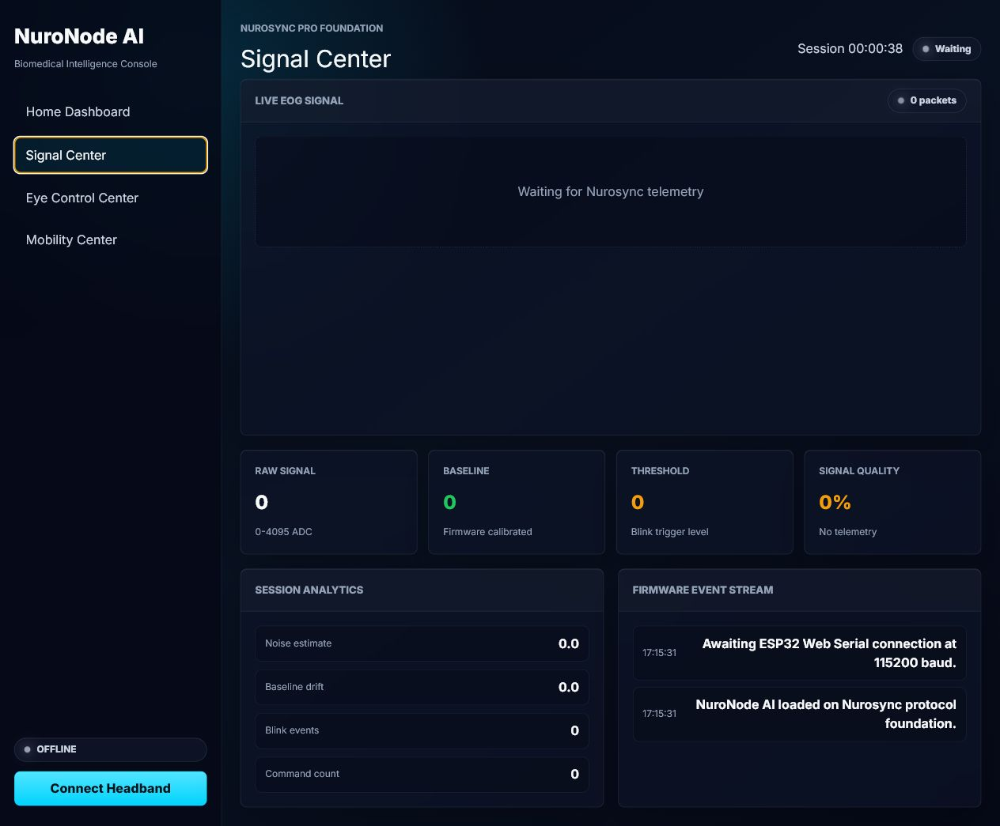
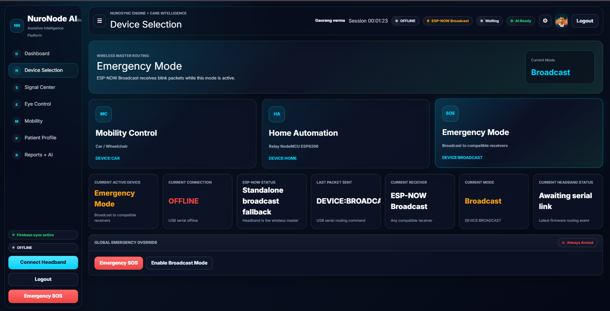
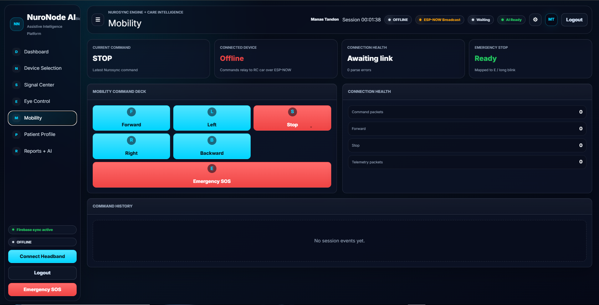

# <p align="center"><br>NuroNode AI</p>
### <p align="center">**The Care and Intelligence Layer for Eye-Controlled Assistive Mobility**</p>

<p align="center">
  
  
  
  
  
  
</p>

---

## 👁️ Executive Summary & Vision

**NuroNode AI** is an assistive mobility and caregiver intelligence platform built on top of the **Nurosync Electrooculography (EOG) eye-control engine**. 

People with severe motor impairments (such as ALS, quadriplegia, or locked-in syndrome) require hands-free, voice-free control systems. While EOG headbands prove that eye signals can drive wheelchair motors, turning raw bio-signals into a safe, daily-use device requires a comprehensive software safety net. 

**NuroNode AI does not replace the hardware control loop—it productizes it.** It acts as a digital safety shield and communication hub, bridging the gap between raw hardware telemetry and real-world caregiving by providing:
1. **Deterministic Eye Mobility:** Map eye blinks to directional wheelchair commands.
2. **Clinical Signal Visualization:** High-fidelity, real-time EOG wave plotting and baseline drift diagnostics.
3. **Emergency SOS & Twilio Alerting:** Automated GPS-linked caregiver SMS alerts when an emergency stop is triggered.
4. **AI-Powered Diagnostics:** Gemini-driven plain-language session interpretation and calibration advisories.
5. **IoT Home Automation:** Trigger smart relays (lights, fans) using eye gestures.

---

## 📸 Platform Interface Gallery

The desktop web application features a sleek, dark-themed, glassmorphic UI optimized for medical dashboards and responsive live monitoring.

<p align="center">
  
  
</p>
<p align="center">
  
  
</p>

---

## ⚡ System Architecture

NuroNode AI connects biological signals, local embedded systems, cloud databases, and AI diagnostic models in a unified pipeline:

```mermaid
graph TD
    %% Biological Signal Source
    User[👁️ Patient Eye Blinks] -->|Microvolt EOG Signals| Headband[🧠 Nurosync Headband: ESP32-S3]
    
    %% Firmware / Local Processing
    subgraph Firmware Level (DSP & Control)
        Headband -->|1. Baseline Calibration| DSP[Bandpass Filter & Adaptive Thresholds]
        DSP -->|2. Blink Sequence Detection| ESPNow[ESP-NOW Wireless Transmitter]
        DSP -->|3. Serial telemetry output| WebSerial[Web Serial Protocol @ 115200 Baud]
    end
    
    %% Wireless Receiver Controls
    ESPNow -.->|Peer-to-Peer Radio| Car[🚗 Wheelchair/RC Car Receiver ESP32]
    Car -->|Motor Output Pins| Motors[⚙️ L298N Motor Driver]
    
    %% Frontend Dashboard
    subgraph Frontend Control Suite (React / Vite)
        WebSerial -->|Raw_Signal, Baseline, Threshold| UI[🖥️ NuroNode React Dashboard]
        UI -->|Send Calibration 'C' / Manual Threshold 'T'| WebSerial
        UI -->|Save Session, Profiles| FB[🔥 Firebase Client Web SDK]
    end
    
    %% Backend Services
    subgraph FastAPI Backend Control Plane
        UI -->|REST APIs & WebSockets| API[🐍 FastAPI App uvicorn]
        API -->|Isolated User Storage| Firestore[(🗄️ Firestore Database)]
        API -->|Session Summary Prompt| Gemini[🤖 Google Gemini 2.5 Flash]
        API -->|Critical Alert Trigger| Twilio[💬 Twilio SMS Gateway]
        API -->|Local Relay Control| Relay[🔌 ESP8266 Smart Automation Relays]
    end
    
    %% Emergency Response Outbound
    Twilio -->|Urgent SMS + Maps Link| Caregiver[👨‍⚕️ Emergency Caregivers]
    Firestore -->|Sanitized Profile| QR[📲 Responder QR Medical Card]
```

---

## 🛠️ Technology Stack

### 🖥️ Frontend (React Dashboard)
* **Core:** React 18 (Vite-powered single-page application)
* **Styling:** TailwindCSS with modern dark-mode glassmorphic cards and glowing status indicators
* **Visualization:** Chart.js + `react-chartjs-2` for live microvolt EOG waveforms running at up to 60fps
* **Cloud Integration:** Firebase Web SDK for authentication and Firestore record syncing

### 🐍 Backend (FastAPI Control Plane)
* **Framework:** FastAPI with Uvicorn (async Python server)
* **Security:** Firebase Admin SDK providing database rules replication and credential isolation
* **Messaging:** Twilio REST API for routing high-priority emergency notifications
* **AI Engine:** Google GenAI SDK for Gemini 2.5 Flash session analysis
* **IoT Protocols:** WebSocket connections to capture serial streams and forward automation state

### 🔌 Firmware (Embedded Systems)
* **Acquisition Node:** ESP32-S3 headband parsing microvolt eye-activity signals via analog electrodes.
* **Mobility Node:** ESP32 RC Car receiver processing directional commands over peer-to-peer ESP-NOW radio.
* **Automation Node:** NodeMCU ESP8266 Web Relay listening for IoT events.

---

## 🧠 Brain-Computer Interface (BCI) Mapping

Blink events are detected natively on the headband microcontroller to avoid safety delays. NuroNode AI parses these events to display signal feedback and update control cards:

| Blinks | Command | Action Description | ESP-NOW Payload | Cooldown / Safety |
| :---: | :--- | :--- | :---: | :--- |
| **1** | `FORWARD` | Move forward (20-second safety timeout limit) | `F` | Protected by 1.5s cooldown |
| **2** | `LEFT` | Make a short pulse-turn to the left | `L` | Pulse turn, auto-stop |
| **3** | `RIGHT` | Make a short pulse-turn to the right | `R` | Pulse turn, auto-stop |
| **4** | `BACKWARD` | Reverse direction | `B` | Protected by 1.5s cooldown |
| **5+** | `STOP` | Normal halting sequence | `S` | Instant bypass (No Cooldown) |
| **Long (1s+)** | `EMERGENCY_STOP` | Lock brakes, trigger caregiver sirens & SOS SMS | `E` | Instant bypass + Twilio alert |

---

## 🔒 Safety Systems & Caregiver Intelligence

Assistive mobility requires multi-tier safety guards:

### 1. The Emergency SOS Engine
* **Detection:** Triggered by a **long blink (1s+)** or a manual click on the Emergency button.
* **Alert Delivery:** Captures the patient's approximate GPS coordinates (via browser Geolocation) and posts a payload to the backend. The backend uses **Twilio** to immediately send an SMS to configured caregiver contacts:
  > 🚨 **NuroNode Emergency Alert**  
  > Patient: Gaurang Verma  
  > Emergency detected through NuroNode AI.  
  > Time: 12:45:10  
  > Location: https://maps.google.com/?q=28.6139,77.2090
* **Audio Alarms:** The dashboard plays a continuous alarm sound to notify local family members.

### 2. Public QR Medical Card
* **Mechanism:** Patient demographics, emergency contacts, medications, allergies, and disability details are stored in Firestore.
* **Data Isolation:** Private dashboard credentials are kept safe under `users/{uid}`, but a sanitized copy of the medical card is cloned to `/public_medical_profiles/{uid}`.
* **Access:** Emergency responders scan a dynamic QR code on the patient's wheelchair to access vital information at `/medical-profile/{uid}` or download a printable PDF report.

### 3. Gemini AI Session Analytics
* **Diagnostics:** At the end of a session, a payload containing cumulative telemetry (signal noise, baseline stability, command distribution, and safety flags) is sent to **Gemini 2.5 Flash**.
* **Output:** Gemini generates a clinical report mapping out baseline drifts, electrode contact reliability, and control strain, converting confusing medical telemetry into actionable caregiver guidance.

---

## 💻 Installation & Quick Start

### Prerequisites
* Python 3.9 or higher
* Node.js v18 or higher
* Arduino IDE (to flash ESP32 chips)
* Google Gemini API Key, Twilio Account (SID, Token, Number), and a Firebase Project.

### 1. Repository Setup
Clone the repository and locate the workspace directory:
```bash
cd "E:\NuroNode AIII"
```

### 2. Backend Installation (FastAPI)
1. Navigate to the backend directory:
   ```bash
   cd backend
   ```
2. Create and activate a virtual environment (optional but recommended):
   ```bash
   python -m venv venv
   # On Windows:
   .\venv\Scripts\activate
   ```
3. Install dependencies:
   ```bash
   pip install -r requirements.txt
   ```
4. Configure environment variables. Copy `.env.example` to `.env` and fill in your credentials:
   ```bash
   cp .env.example .env
   ```
   *Required variables:*
   ```ini
   FIREBASE_PROJECT_ID=your-firebase-project-id
   FIREBASE_WEB_API_KEY=your-firebase-web-api-key
   FIREBASE_SERVICE_ACCOUNT_JSON={"type": "service_account", ...}
   TWILIO_ACCOUNT_SID=ACXXXXXXXXXXXXXXXXXXXXXXXXXXXXXXXX
   TWILIO_AUTH_TOKEN=your_twilio_auth_token
   TWILIO_FROM_NUMBER=+1234567890
   GEMINI_API_KEY=your_gemini_api_key
   ```
5. Run the FastAPI development server:
   ```bash
   uvicorn main:app --reload --host 127.0.0.1 --port 8000
   ```
   Swagger API interactive docs will be available at `http://localhost:8000/docs`.

### 3. Frontend Installation (React + Vite)
1. Return to the root workspace directory and install Node dependencies:
   ```bash
   cd ..
   npm install
   ```
2. Configure frontend env parameters if needed (Vite defaults to `http://localhost:8000` for backend communication).
3. Start the local Vite development server:
   ```bash
   npm run dev
   ```
4. Open the displayed URL (typically `http://localhost:5173`) in Google Chrome or Microsoft Edge (required for Web Serial API support).

### 4. Firmware Installation
Open the files in `firmware/` using the Arduino IDE:
1. **ESP32-S3 Headband:** Open `firmware/NuroSync_Headband_DSP/NuroSync_Headband_DSP.ino/NuroSync_Headband_DSP.ino.ino`. Install ESP32 board definitions, verify pin configuration for EOG electrodes, and upload.
2. **ESP32 Car Receiver:** Open `firmware/NuroSync_Car_ESPNow_Receiver.ino/NuroSync_Car_ESPNow_Receiver.ino.ino`. Upload to the receiver node connected to the L298N motor driver.
3. **ESP8266 Relay Node:** Open `firmware/esp8266_relay/esp8266_relay.ino` and upload to the smart switch controller.

---

## 🏆 Hackathon Demo Walkthrough Script

When presenting to the jury, use this high-impact 3-minute sequence:

1. **The Problem Pitch (0:00 - 0:30):** Explain how patients with severe paralysis cannot use normal joysticks. Show the Nurosync headband and explain that it reads microvolt eye signals.
2. **Connection & Waveform (0:30 - 1:15):** Load the dashboard in Chrome, connect via **Web Serial**, and navigate to **Signal Center**. Show the live, glowing EOG waveform and trigger a blink to demonstrate the real-time microvolt spike crossing the dynamic threshold line.
3. **Mobility Control Loop (1:15 - 2:00):** Navigate to the **Mobility Center**. Execute a **double blink** to turn left, then a **single blink** to move forward. Point out that the command history logs the source as `Headband Blink`.
4. **Safety Trigger & Caregiver SOS (2:00 - 2:30):** Perform a **long blink (1s+)**. The dashboard immediately enters **Emergency Mode** (siren sound plays, flashing red header). Show the Twilio logs or your phone screen receiving the SMS alert with the live Google Maps coordinates of the wheelchair.
5. **Session Interpretation & AI (2:30 - 3:00):** Stop the session. Navigate to the **Reports + AI** tab. Click "Analyze Session". Show the clinical metrics panel, and review the Gemini AI-generated session report explaining the EOG metrics to the caregiver.

---

## 👨‍💻 Contributor Profile
* **Developer:** Gaurang Verma ([@developer-gaurang](https://github.com/developer-gaurang))
* **Email:** vgaurang583@gmail.com
* **Role:** Lead System Architect & Hardware Engineer

---
<p align="center">
  <i>NuroNode AI: Restoring independence, securing safety, and empowering caregivers—one blink at a time.</i>
</p>
