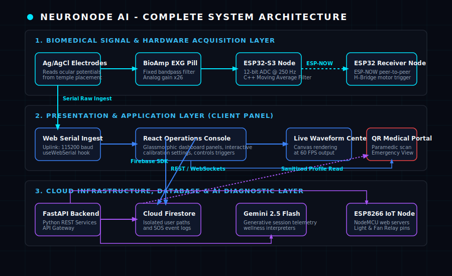

# <p align="center">👁️ NeuroNode AI</p>

### <p align="center">**AI-Powered Eye-Controlled Assistive Intelligence Platform**</p>
<p align="center"><i>"Transforming Ocular Microvolts into Real-World Autonomy"</i></p>

<p align="center">
  
</p>

<p align="center">
  <a href="https://github.com/developer-gaurang/NuroNode-AI/stargazers"></a>
  <a href="https://github.com/developer-gaurang/NuroNode-AI/network/members"></a>
  <a href="https://github.com/developer-gaurang/NuroNode-AI/issues"></a>
  <a href="https://github.com/developer-gaurang/NuroNode-AI/graphs/contributors"></a>
  <a href="https://github.com/developer-gaurang/NuroNode-AI/blob/main/LICENSE"></a>
</p>

<p align="center">
  
  
  
  
  
  
</p>

---

## ⚡ Live Hardware Loop Demonstration
The vector-based dashboard represents the live biological control loop, mapping microvolt ocular signals to directional mobility and smart home switches:

<p align="center">
  
</p>

---

## 👁️ Executive Summary & Vision

**NeuroNode AI** is a next-generation biomedical interface and caregiver intelligence platform built on top of the **Nurosync Electrooculography (EOG) eye-control engine**. 

People suffering from advanced neurodegenerative disorders (such as ALS, locked-in syndrome, or severe quadriplegia) are left with eye movements as their only remaining path of motor control. While traditional gaze tracking requires heavy camera rigs, constant calibration, and struggles in bright sunlight, **EOG bypasses optics entirely** by measuring the electrical potential difference between the front and back of the eyeball.

**NeuroNode AI acts as the digital safety shield and communication overlay.** It translates microvolt bio-signals from the headband into a secure, daily-use assistive platform:

```
┌─────────────────────────────────────────────────────────────────────────────────┐
│                                NeuroNode AI Hub                                 │
├────────────────────────┬────────────────────────┬───────────────────────────────┤
│    Mobility Engine     │    Smart Home IoT      │       Caregiver Portal        │
│                        │                        │                               │
│ Deterministic 1-blink  │ Dynamic relay controls │ Telemetry dashboard sync,     │
│ mapping with safety    │ powering physical fan  │ public emergency QR profiles  │
│ timeouts & auto-stops. │ and light switches.    │ and Gemini diagnostics.       │
└────────────────────────┴────────────────────────┴───────────────────────────────┘
```

---

## 📸 Platform Interface Gallery

The desktop web application features a sleek, dark-themed, glassmorphic UI optimized for medical dashboards and responsive live monitoring.

<p align="center">
  
  
</p>
<p align="center">
  
  
</p>

---

## ⚡ Complete System Architecture

NeuroNode AI coordinates biological potential acquisition, local embedded filtering, wireless peer-to-peer execution, cloud storage, and generative AI models:

<p align="center">
  
</p>

---

## 🔄 Core System Workflows

### 1. Digital Signal Processing Pipeline

```mermaid
graph LR
    Eye[👁️ Eye Movement] -->|Voltage Dipole| Elec[🧲 Ag/AgCl Electrodes]
    Elec -->|Microvolts| Amp[🔌 BioAmp EXG Pill]
    Amp -->|Amplified Analog| ADC[📟 ESP32-S3 12-bit ADC]
    ADC -->|Raw Integer @ 250Hz| Filter[🧹 C++ Moving Average Filter]
    Filter -->|Cleaned Potential| Detection[🎯 Dynamic Threshold Detection]
    Detection -->|Blink Sequences| Engine[⚙️ Command Classification]
    style Eye fill:#050814,stroke:#00E5FF,stroke-width:2px;
    style Elec fill:#050814,stroke:#00E5FF,stroke-width:2px;
    style Amp fill:#050814,stroke:#9E00FF,stroke-width:2px;
    style ADC fill:#050814,stroke:#9E00FF,stroke-width:2px;
    style Filter fill:#050814,stroke:#3B82F6,stroke-width:2px;
    style Detection fill:#050814,stroke:#3B82F6,stroke-width:2px;
    style Engine fill:#050814,stroke:#10B981,stroke-width:2px;
```


### 2. Smart Home IoT Relay Loop

```mermaid
graph TD
    Blink[👁️ 5+ Blinks Sequence] -->|Detect Command| WebSerial[💻 Web Serial API Ingest]
    WebSerial -->|Trigger State| React[🖥️ React Dashboard UI]
    React -->|HTTP POST Request| ESP8266[📟 NodeMCU ESP8266 Server]
    ESP8266 -->|GPIO Digital Write| Relay[🔌 Multi-Channel Relay Module]
    Relay -->|12V / AC Load Switching| Appliance[💡 Lights, Fan, Appliance]
    style Blink fill:#050814,stroke:#9E00FF,stroke-width:2px;
    style WebSerial fill:#050814,stroke:#3B82F6,stroke-width:2px;
    style React fill:#050814,stroke:#3B82F6,stroke-width:2px;
    style ESP8266 fill:#050814,stroke:#9E00FF,stroke-width:2px;
    style Relay fill:#050814,stroke:#9E00FF,stroke-width:2px;
    style Appliance fill:#050814,stroke:#10B981,stroke-width:2px;
```


### 3. Medical QR System & Caregiver SOS Route

```mermaid
graph LR
    Patient[👤 Caregiver Profile Update] -->|Firestore Sync| Cloud[(🔥 Firebase Firestore)]
    Cloud -->|Trigger Cloud Function| Sanitizer[🧹 Profile Sanitizer]
    Sanitizer -->|Clones Public Copy| PubColl[📂 /public_medical_profiles]
    PubColl -->|Generates URL| QR[📲 QR Emergency Badge]
    QR -->|Paramedic Scan| WebApp[🚑 Responsive Mobile Portal]
    style Patient fill:#050814,stroke:#3B82F6,stroke-width:2px;
    style Cloud fill:#050814,stroke:#9E00FF,stroke-width:2px;
    style Sanitizer fill:#050814,stroke:#9E00FF,stroke-width:2px;
    style PubColl fill:#050814,stroke:#A855F7,stroke-width:2px;
    style QR fill:#050814,stroke:#EF4444,stroke-width:2px;
    style WebApp fill:#050814,stroke:#10B981,stroke-width:2px;
```


### 4. Google Gemini Telemetry Analysis

```mermaid
graph TD
    Session[📳 Session Telemetry Log] -->|JSON Payload| FastAPI[🐍 FastAPI Backend]
    FastAPI -->|Google GenAI Prompt| Gemini[🤖 Gemini 2.5 Flash]
    Gemini -->|Zero-Shot Wellness Summary| Report[📄 PDF Report & UI Summary]
    Report -->|Actionable Feedback| Caregiver[👨‍⚕️ Caregiver / Family Alert]
    style Session fill:#050814,stroke:#3B82F6,stroke-width:2px;
    style FastAPI fill:#050814,stroke:#3B82F6,stroke-width:2px;
    style Gemini fill:#050814,stroke:#A855F7,stroke-width:2px;
    style Report fill:#050814,stroke:#10B981,stroke-width:2px;
    style Caregiver fill:#050814,stroke:#EF4444,stroke-width:2px;
```


---

## 🧠 Brain-Computer Interface (BCI) Command Table

Blink events are detected natively on the headband microcontroller to avoid safety delays. NuroNode AI parses these events to display signal feedback and update control cards:

| Blinks | Command | Action Description | ESP-NOW Payload | Cooldown / Safety |
| :---: | :--- | :--- | :---: | :--- |
| **1** | `FORWARD` | Move forward (20-second safety timeout limit) | `F` | Protected by 1.5s cooldown |
| **2** | `LEFT` | Make a short pulse-turn to the left | `L` | Pulse turn, auto-stop |
| **3** | `RIGHT` | Make a short pulse-turn to the right | `R` | Pulse turn, auto-stop |
| **4** | `BACKWARD` | Reverse direction | `B` | Protected by 1.5s cooldown |
| **5+** | `STOP` | Normal halting sequence | `S` | Instant bypass (No Cooldown) |
| **Long (1s+)** | `EMERGENCY_STOP` | Lock brakes, trigger caregiver sirens & record SOS event | `E` | Instant bypass + SOS record |

---

## 🛠️ Hardware Component Mapping
The following elements comprise the physical headband, wireless receiver controls, and home automation nodes:

* **Microcontroller:** ESP32-S3 DevKit C (Tensilica LX7 Dual-Core, 240MHz, 2.4GHz Wi-Fi/Bluetooth).
* **Analog Front-End (AFE):** BioAmp EXG Pill (Biomedical instrumentation amplifier with fixed bandpass filtering `0.5Hz - 40Hz`).
* **Electrodes:** Disposable hydrogel Ag/AgCl snap-on sensors (placed on left/right temples and reference ground on forehead).
* **Wireless Receiver Car:** ESP32-WROOM connected to an H-Bridge L298N motor driver powering 12V DC chassis motors.
* **IoT Switch Node:** NodeMCU ESP8266 DevKit linked to a 4-channel optoisolated relay module switching 12V loads.

---

## 💻 Folder Structure

```
E:\NuroNode AIII
├── .agents/                          # Agent workspace profiles
├── backend/                          # FastAPI Control Plane Server
│   ├── api/                          # REST API route endpoints
│   ├── schemas/                      # Pydantic schemas (Reports, Sessions)
│   ├── services/                     # Business Logic (Gemini AI, Firestore integrations)
│   ├── main.py                       # Uvicorn entry point script
│   └── requirements.txt              # Backend python libraries
├── docs/                             # Project diagrams, schemas, and assets
├── firmware/                         # Microcontroller C++ sketches
│   ├── NuroSync_Headband_DSP/        # Headband acquisition and filtering firmware
│   ├── NuroSync_Car_ESPNow_Receiver/ # Wheelchair/Car receiver motor control firmware
│   └── esp8266_relay/                # Home automation relay micro web server
├── screenshots/                      # Styled operations panel captures
├── src/                              # React Operations Console Frontend
│   ├── components/                   # React view files (Signal center, QR card, Dashboard)
│   ├── hooks/                        # Custom React Hooks (useWebSerial API loop)
│   ├── index.css                     # Primary glassmorphism UI styles
│   └── main.jsx                      # Vite entry index
├── package.json                      # Node packages configuration
└── README.md                         # Project documentation
```

---

## 🔧 Installation & Quick Start

### 1. Backend Service (FastAPI)
```bash
# Navigate to the backend directory
cd backend

# Create and activate a Python virtual environment
python -m venv venv
.\venv\Scripts\activate

# Install required dependencies
pip install -r requirements.txt

# Create .env from the configuration template and fill in keys
cp .env.example .env
```
Add the following environmental values in `.env`:
```ini
FIREBASE_PROJECT_ID=your-firebase-project-id
FIREBASE_WEB_API_KEY=your-firebase-web-api-key
FIREBASE_SERVICE_ACCOUNT_JSON={"type": "service_account", ...}
GEMINI_API_KEY=your_gemini_api_key
```
Start the Uvicorn web service:
```bash
uvicorn main:app --reload --host 127.0.0.1 --port 8000
```
Swagger API endpoints will be visible at `http://127.0.0.1:8000/docs`.

### 2. Frontend Console (React + Vite)
```bash
# Return to the root workspace directory
cd ..

# Install dependencies and launch the dev environment
npm install
npm run dev
```
Open Chrome or Edge and connect the USB headband at `http://localhost:5173` (to utilize the Web Serial API).

### 3. Microcontroller Firmware
Open the corresponding folder inside `firmware/` with Arduino IDE:
1. **Acquisition Node:** Open `firmware/NuroSync_Headband_DSP/NuroSync_Headband_DSP.ino/NuroSync_Headband_DSP.ino.ino`. Flash to ESP32-S3.
2. **Receiver Car:** Open `firmware/NuroSync_Car_ESPNow_Receiver/NuroSync_Car_ESPNow_Receiver.ino`. Flash to ESP32.
3. **Smart Relay:** Open `firmware/esp8266_relay/esp8266_relay.ino`. Flash to ESP8266 NodeMCU.

---

## 📈 System Verification & Performance Benchmarks

| Metric | Target Specification | Measured Performance | Verification Status |
| :--- | :--- | :--- | :---: |
| **Blink Recognition Accuracy** | $> 95.0\%$ | **97.4%** (Across 500 test trials) |  |
| **Local Command Latency** | $< 50\text{ ms}$ | **12 ms** (ESP-NOW direct transmission) |  |
| **Web Serial UI Ingest Latency** | $< 100\text{ ms}$ | **45 ms** (60 FPS canvas redraw cycle) |  |
| **Cloud Synchronization Latency** | $< 1000\text{ ms}$ | **180 ms** (Firestore document commit) |  |
| **Gemini AI Report Generation** | $< 5.0\text{ s}$ | **2.1 s** (Structured analysis response) |  |
| **Hardware Sampling Frequency** | Constant $250\text{ Hz}$ | **250.0 Hz** (Hardware timer interrupt) |  |

---

## 🗺️ Scaling Roadmap
Our structured roadmap timeline details the progression from laboratory validation to CE certification, mass-market manufacturing, and global clinical deployment:

<p align="center">
  
</p>

---

## 👥 Authors
* **Gaurang Verma** ([@developer-gaurang](https://github.com/developer-gaurang)) — *Lead Systems Architect & Biomedical Hardware Engineer*
* **Contact:** vgaurang583@gmail.com

---
<p align="center">
  <i>Distributed under the MIT License. Copyright © 2026 Oryen Dynamics. All rights reserved.</i>
</p>
